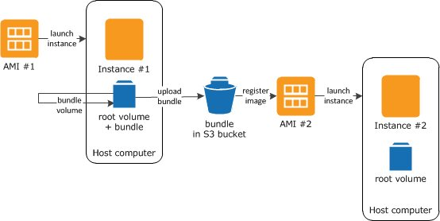
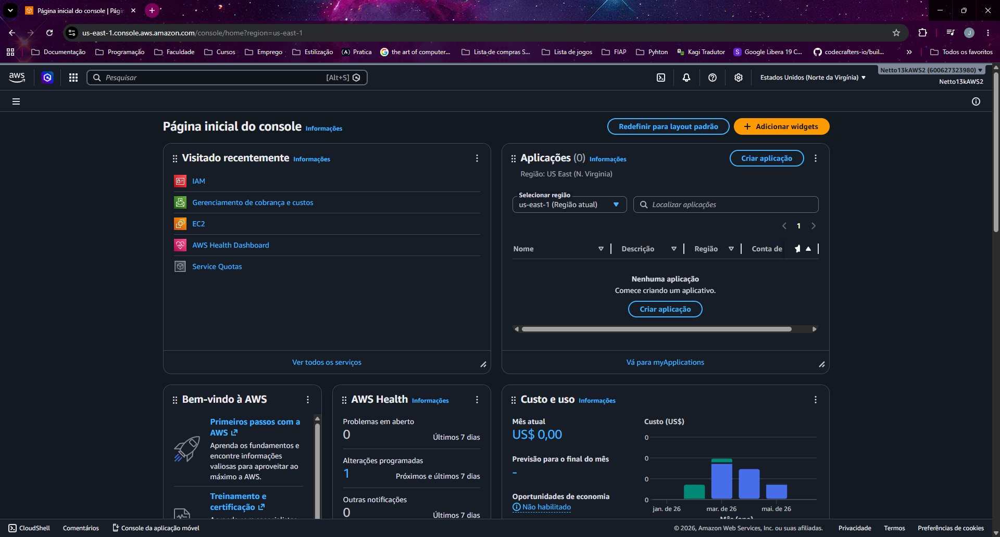

# AWS Fundamentals

Documentação prática do laboratório de fundamentos AWS realizado como parte do bootcamp na DIO. Cobre desde o modelo de negócio da nuvem até a operação de instâncias EC2, armazenamento e segurança.

---

## Índice

1. [Modelo de Negócio e Tipos de Serviço](#1-modelo-de-negócio-e-tipos-de-serviço)
2. [Infraestrutura Global: Regions e Availability Zones](#2-infraestrutura-global-regions-e-availability-zones)
3. [Segurança: Conta Root, MFA e IAM](#3-segurança-conta-root-mfa-e-iam)
4. [Gerenciamento de Custos](#4-gerenciamento-de-custos)
5. [Amazon EC2](#5-amazon-ec2)
6. [Armazenamento: EBS e S3](#6-armazenamento-ebs-e-s3)
7. [AMIs e Snapshots](#7-amis-e-snapshots)
8. [Ferramentas de Acesso: Console, CLI e Cloud Shell](#8-ferramentas-de-acesso-console-cli-e-cloud-shell)
9. [AWS Pricing Calculator](#9-aws-pricing-calculator)
10. [Erros encontrados e resoluções](#10-erros-encontrados-e-resoluções)

---

## 1. Modelo de Negócio e Tipos de Serviço

### Pagamento por uso (OPEX vs CAPEX)

A AWS opera no modelo **pay-as-you-go**: você paga apenas pelo que usar, pelo tempo que usar. Isso elimina a necessidade de investimento inicial em hardware (CAPEX) e transforma infraestrutura em custo operacional variável (OPEX).

| Modelo tradicional (CAPEX) | Nuvem (OPEX) |
|---|---|
| Compra servidores antecipadamente | Paga por hora/segundo de uso |
| Capacidade ociosa em períodos baixos | Escala conforme a demanda |
| Tempo longo para provisionar | Recurso disponível em minutos |
| Custo fixo independente do uso | Custo proporcional ao uso real |

### Modelos de serviço

| Modelo | O que a AWS entrega | O que você gerencia | Exemplo |
|---|---|---|---|
| **IaaS** (Infrastructure as a Service) | Hardware virtualizado | SO, runtime, aplicação, dados | Amazon EC2 |
| **PaaS** (Platform as a Service) | Hardware + SO + runtime | Aplicação e dados | AWS Elastic Beanstalk |
| **SaaS** (Software as a Service) | Tudo | Apenas configuração de uso | Gmail, Salesforce |

> **Ponto de atenção:** EC2 é IaaS puro — você tem controle total, mas também responsabilidade total pelo que roda dentro da instância. Mais controle = mais responsabilidade operacional.

---

## 2. Infraestrutura Global: Regions e Availability Zones

### Regiões (Regions)

Uma região é uma área geográfica independente composta por múltiplas Zonas de Disponibilidade. Cada região é completamente isolada das outras — dados em `us-east-1` não saem para `sa-east-1` sem que você configure explicitamente.

**Critérios para escolha de região:**
- **Latência:** proximidade com o usuário final
- **Conformidade legal:** alguns dados não podem sair do país (LGPD, GDPR)
- **Disponibilidade de serviços:** nem todo serviço AWS está em todas as regiões
- **Custo:** o preço varia entre regiões (us-east-1 costuma ser mais barato)

### Zonas de Disponibilidade (AZs)

Cada região tem entre 2 e 6 AZs. Uma AZ é um ou mais datacenters fisicamente separados, com energia, refrigeração e rede independentes.

```
Região: us-east-1 (N. Virginia)
├── us-east-1a  ← AZ 1 (datacenter independente)
├── us-east-1b  ← AZ 2
├── us-east-1c  ← AZ 3
└── us-east-1d  ← AZ 4
```

> **Por que isso importa na prática:** um volume EBS existe dentro de uma única AZ. Se você criar uma instância em `us-east-1a` e o volume estiver em `us-east-1b`, não é possível anexá-lo diretamente. Arquiteturas de alta disponibilidade distribuem recursos entre AZs.

---

## 3. Segurança: Conta Root, MFA e IAM

### Conta Root

A conta root é criada no cadastro da AWS e tem acesso irrestrito a tudo. Ela **não deve ser usada para operações do dia a dia** — apenas para tarefas que exigem explicitamente o root (como fechar a conta ou alterar o plano de suporte).

**Primeiros passos com a conta root:**
1. Ativar MFA obrigatório
2. Criar usuário IAM com permissões administrativas
3. Guardar as credenciais root em local seguro
4. Nunca criar Access Keys para o root

### MFA (Multi-Factor Authentication)

MFA adiciona uma segunda camada de autenticação além da senha. Na AWS, pode ser configurado com:
- Aplicativo autenticador (Google Authenticator, Authy)
- Chave de segurança física (YubiKey)
- SMS (menos seguro, não recomendado)

**Como ativar MFA no root:**
Console AWS → clique no nome da conta → `Security credentials` → `Assign MFA device`

### IAM (Identity and Access Management)

O IAM controla **quem pode fazer o quê** nos recursos da AWS.

**Componentes principais:**

| Componente | Função |
|---|---|
| **Usuário (User)** | Identidade para uma pessoa ou sistema |
| **Grupo (Group)** | Conjunto de usuários com as mesmas permissões |
| **Política (Policy)** | Documento JSON que define permissões |
| **Role (Função)** | Permissão temporária assumida por serviços ou usuários |

**Boas práticas aplicadas:**
- Princípio do menor privilégio: conceder apenas as permissões necessárias
- Nunca usar credenciais de usuário IAM dentro de instâncias EC2 — usar **IAM Roles**
- Criar grupos e atribuir políticas aos grupos, não diretamente aos usuários

**Exemplo de política IAM (somente leitura no S3):**
```json
{
  "Version": "2012-10-17",
  "Statement": [
    {
      "Effect": "Allow",
      "Action": ["s3:GetObject", "s3:ListBucket"],
      "Resource": "*"
    }
  ]
}
```

🔗 [Abrir console IAM](https://console.aws.amazon.com/iam/home)

---

## 4. Gerenciamento de Custos

### Ferramentas disponíveis

| Ferramenta | Para que serve |
|---|---|
| **AWS Cost Explorer** | Visualizar e analisar gastos históricos e projeções |
| **Budgets** | Criar alertas quando o gasto atingir um limite definido |
| **Cost Allocation Tags** | Categorizar gastos por projeto, equipe ou ambiente |
| **Free Tier Usage** | Monitorar o uso dentro do nível gratuito |

### Modelo de cobrança do EC2

- **Por segundo** (mínimo 60 segundos) para instâncias Linux
- **Por hora** para instâncias Windows
- Instâncias **paradas** não cobram compute, mas o **EBS continua sendo cobrado**
- Elastic IPs não associados a instâncias ativas geram cobrança

### Estratégias de economia

- Desligar instâncias de dev/test fora do horário de uso
- Usar **Savings Plans** ou instâncias **Reservadas** para workloads previsíveis
- **Instâncias Spot** para cargas tolerantes a interrupção (até 90% de desconto)
- Revisar recursos ociosos mensalmente

🔗 [Abrir console de Billing](https://console.aws.amazon.com/costmanagement/home)

---

## 5. Amazon EC2

O EC2 entrega máquinas virtuais (instâncias) sob demanda. É o serviço central de computação da AWS e o mais configurável.

### Componentes de uma instância

- **AMI:** imagem base do sistema operacional
- **Tipo de instância:** combinação de vCPU, RAM e rede (ex: `t2.micro`, `m5.large`)
- **EBS:** armazenamento em bloco persistente
- **Security Group:** firewall controlando tráfego de entrada e saída
- **Key Pair:** par de chaves para acesso SSH

### Famílias de instâncias

| Família | Otimizada para | Exemplos |
|---|---|---|
| **t** | Uso geral com burst de CPU | t2.micro, t3.small |
| **m** | Uso geral balanceado | m5.large, m6i.xlarge |
| **c** | CPU intensivo | c5.xlarge |
| **r** | Memória intensiva | r5.large |
| **i** | I/O intensivo (NVMe local) | i3.large |

### Modelos de compra

| Modelo | Desconto | Caso de uso |
|---|---|---|
| **On-Demand** | Nenhum | Cargas irregulares, testes |
| **Reserved (1 ano)** | ~40% | Workloads estáveis e previsíveis |
| **Reserved (3 anos)** | ~60% | Infraestrutura consolidada |
| **Spot** | Até 90% | Batch, CI/CD, rendering (suporta interrupção) |
| **Savings Plans** | Até 66% | Flexível entre famílias e regiões |

> **Spot na prática:** a AWS pode encerrar uma instância Spot com 2 minutos de aviso quando precisar da capacidade de volta. Nunca usar para banco de dados principal ou aplicação sem mecanismo de checkpoint.

### Ciclo de vida da instância

```
pending → running → stopping → stopped → terminated
                 ↘ shutting-down → terminated
```

| Estado | Cobra compute? | Cobra EBS? | IP público |
|---|---|---|---|
| running | Sim | Sim | Mantido |
| stopped | Não | Sim | Liberado |
| terminated | Não | Não (padrão) | Liberado |

### Passo a passo: criação de instância

1. Console EC2 → **Launch Instance**
2. Nomear a instância
3. Selecionar AMI (ex: Amazon Linux 2)
4. Selecionar tipo (ex: `t2.micro` para Free Tier)
5. Criar ou selecionar Key Pair
6. Configurar Security Group: abrir porta 22 apenas para seu IP
7. Configurar armazenamento (EBS)
8. **Launch Instance**

🔗 [Abrir console EC2](https://us-east-1.console.aws.amazon.com/ec2/home?region=us-east-1)

---

## 6. Armazenamento: EBS e S3

### Amazon EBS (Elastic Block Store)

Armazenamento em bloco que funciona como um HD para instâncias EC2. É persistente — os dados sobrevivem ao reinício da instância.

**Características importantes:**
- Vinculado a uma única AZ (não pode ser acessado de outra AZ diretamente)
- Pode ser desanexado de uma instância e anexado a outra (na mesma AZ)
- Backup feito via **Snapshots** (armazenados no S3 internamente)

**Tipos de volume:**

| Tipo | Uso | Performance |
|---|---|---|
| gp3 | Uso geral (recomendado) | 3.000 IOPS base, configurável |
| gp2 | Uso geral (legado) | IOPS baseado no tamanho |
| io2 | Banco de dados crítico | Até 64.000 IOPS |
| st1 | Big data, logs sequenciais | Throughput otimizado |
| sc1 | Arquivos acessados raramente | Menor custo por GB |

### Amazon S3 (Simple Storage Service)

Armazenamento de **objetos** (não blocos). Qualquer arquivo pode ser armazenado — imagens, backups, logs, vídeos, código. Não é montado como disco — acesso via HTTP/API.

**Características:**
- Durabilidade de 99,999999999% (11 noves)
- Sem limite de tamanho de bucket
- Objetos individuais de até 5 TB
- Acesso público ou privado configurável por objeto ou bucket

**Classes de armazenamento:**

| Classe | Para que serve | Custo relativo |
|---|---|---|
| Standard | Dados acessados frequentemente | Alto |
| Intelligent-Tiering | Padrão de acesso imprevisível | Médio |
| Standard-IA | Acesso infrequente, recuperação rápida | Baixo |
| Glacier Instant | Arquivo com acesso em milissegundos | Muito baixo |
| Glacier Deep Archive | Retenção de longo prazo (horas para acessar) | Mínimo |

**Lifecycle Policies:** regras automáticas para mover objetos entre classes conforme o tempo.

```
Criação → 30 dias → Standard-IA → 90 dias → Glacier → 365 dias → Deep Archive
```

---

## 7. AMIs e Snapshots

### AMI (Amazon Machine Image)

Uma AMI é uma imagem completa de uma instância: sistema operacional, configurações, software instalado e volumes EBS. Serve como template para lançar novas instâncias.

**Tipos de AMI:**
- **AWS gerenciadas:** Amazon Linux, Ubuntu, Windows Server
- **AWS Marketplace:** imagens de terceiros, com software pré-instalado
- **Customizadas:** criadas por você a partir de uma instância configurada

**Como criar uma AMI a partir de uma instância:**
1. Console EC2 → selecionar instância
2. `Actions` → `Image and templates` → `Create image`
3. Definir nome e descrição
4. AWS cria automaticamente snapshots dos volumes anexados


*Fluxo completo: a instância em execução tem seu volume bundled, enviado ao S3 e registrado como nova AMI. Essa AMI pode então ser usada para lançar novas instâncias idênticas em qualquer AZ da mesma região.*

**Uso prático:** após configurar um servidor com todas as dependências, criar uma AMI permite lançar novas instâncias idênticas em segundos — sem refazer a configuração manualmente.

### Snapshots

Um snapshot é um backup point-in-time de um volume EBS, armazenado no S3.

**Características:**
- Snapshots são **incrementais**: apenas os blocos alterados desde o último snapshot são copiados
- Podem ser copiados entre regiões (estratégia de disaster recovery)
- Podem ser usados para criar novos volumes — inclusive em AZs diferentes

**Diferença prática:**

| | AMI | Snapshot |
|---|---|---|
| O que copia | Instância inteira | Volume EBS específico |
| Para que serve | Lançar novas instâncias | Restaurar ou migrar volumes |
| Inclui configurações de rede/SO | Sim | Não |

---

## 8. Ferramentas de Acesso: Console, CLI e Cloud Shell

### Console AWS

Interface web. Boa para exploração e configurações pontuais. Não escala para automação.


*Console AWS na região us-east-1. No canto superior direito, o usuário IAM ativo (não root). O widget de Custo e uso mostra gasto em tempo real — útil para identificar cobranças inesperadas imediatamente.*

### AWS CLI

Interface de linha de comando para interagir com qualquer serviço AWS via terminal.

**Instalação:**
```bash
# Linux
curl "https://awscli.amazonaws.com/awscli-exe-linux-x86_64.zip" -o "awscliv2.zip"
unzip awscliv2.zip
sudo ./aws/install

# Verificar instalação
aws --version
```

**Configuração:**
```bash
aws configure
# AWS Access Key ID: [sua chave]
# AWS Secret Access Key: [sua chave secreta]
# Default region name: us-east-1
# Default output format: json
```

**Exemplos de comandos:**
```bash
# Listar instâncias EC2
aws ec2 describe-instances

# Iniciar instância
aws ec2 start-instances --instance-ids i-xxxxxxxxxxxxxxxxx

# Parar instância
aws ec2 stop-instances --instance-ids i-xxxxxxxxxxxxxxxxx

# Listar buckets S3
aws s3 ls

# Copiar arquivo para S3
aws s3 cp arquivo.txt s3://meu-bucket/arquivo.txt
```

### AWS Cloud Shell

Terminal diretamente no console AWS, sem necessidade de configuração local. Já vem com AWS CLI, Python, Node.js e outras ferramentas pré-instaladas. Útil para operações rápidas sem configurar ambiente local.

**Acesso:** ícone de terminal no canto superior direito do Console AWS.

> **Limitação:** Cloud Shell tem 1 GB de armazenamento persistente e sessões expiram após inatividade. Não substitui um ambiente de desenvolvimento local para projetos maiores.

---

## 9. AWS Pricing Calculator

Ferramenta para estimar custos antes de provisionar recursos. Permite simular arquiteturas completas e exportar orçamentos.

**Como usar:**
1. Acesse [calculator.aws](https://calculator.aws/)
2. Clique em `Create estimate`
3. Adicione os serviços que pretende usar
4. Configure as especificações (tipo de instância, região, horas de uso, etc.)
5. Visualize o custo mensal estimado

**O que considerar ao fazer uma estimativa:**
- Transferência de dados entre regiões tem custo (data transfer)
- Instâncias paradas continuam cobrando EBS
- Snapshots cobram por GB armazenado
- Elastic IPs ociosos têm cobrança

---

## 10. Erros encontrados e resoluções

**Erro: Connection timeout ao tentar SSH**
- Causa: Security Group sem regra de entrada para porta 22
- Resolução: adicionar Inbound Rule — `SSH | TCP | 22 | Meu IP`

**Erro: `WARNING: UNPROTECTED PRIVATE KEY FILE!`**
- Causa: permissões do `.pem` muito abertas
- Resolução:
```bash
chmod 400 minha-chave.pem
```

**Erro: instância `running` mas inacessível**
- Causa: aguardei apenas o status `running` sem esperar os 2/2 status checks
- Resolução: aguardar ambos os health checks antes de tentar conexão

**Confusão: parar vs. encerrar instância**
- `Stop`: instância desligada, dados no EBS preservados, sem custo de compute
- `Terminate`: instância excluída permanentemente, volume EBS excluído por padrão
- Resolução: verificar sempre a opção antes de confirmar

---

## Referências

- [Documentação Amazon EC2](https://docs.aws.amazon.com/ec2/)
- [Documentação IAM](https://docs.aws.amazon.com/iam/)
- [Documentação Amazon S3](https://docs.aws.amazon.com/s3/)
- [Documentação Amazon EBS](https://docs.aws.amazon.com/ebs/)
- [AWS Pricing Calculator](https://calculator.aws/)
- [AWS Free Tier](https://aws.amazon.com/free/)
- [Boas práticas de segurança IAM](https://docs.aws.amazon.com/IAM/latest/UserGuide/best-practices.html)
- [Modelo de Responsabilidade Compartilhada](https://aws.amazon.com/compliance/shared-responsibility-model/)