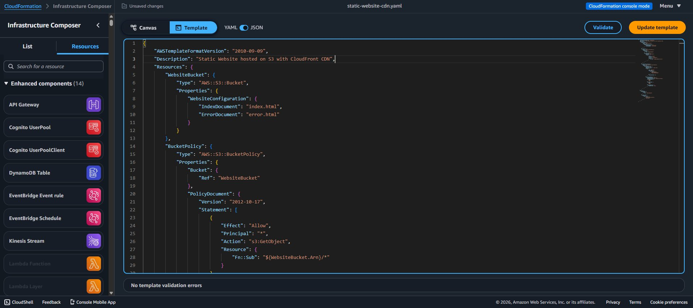
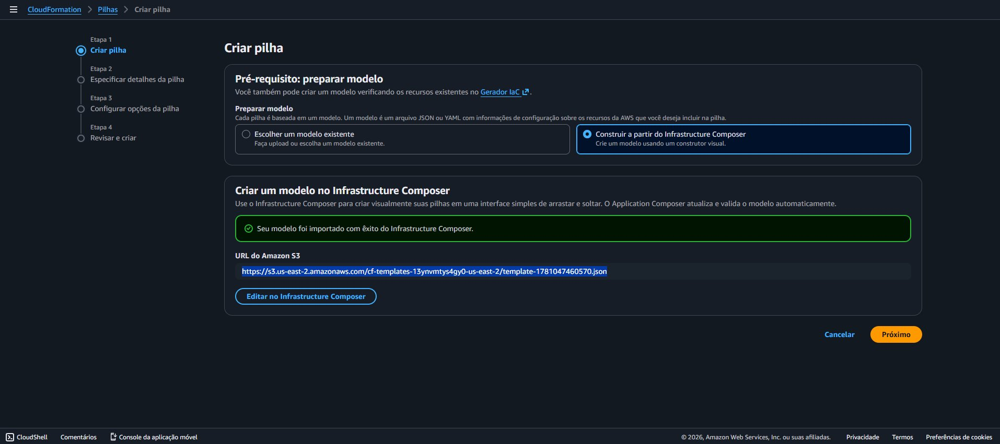
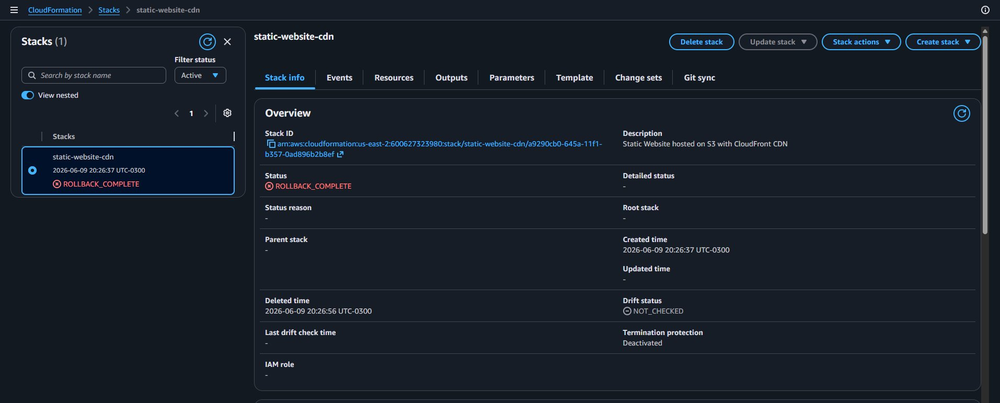
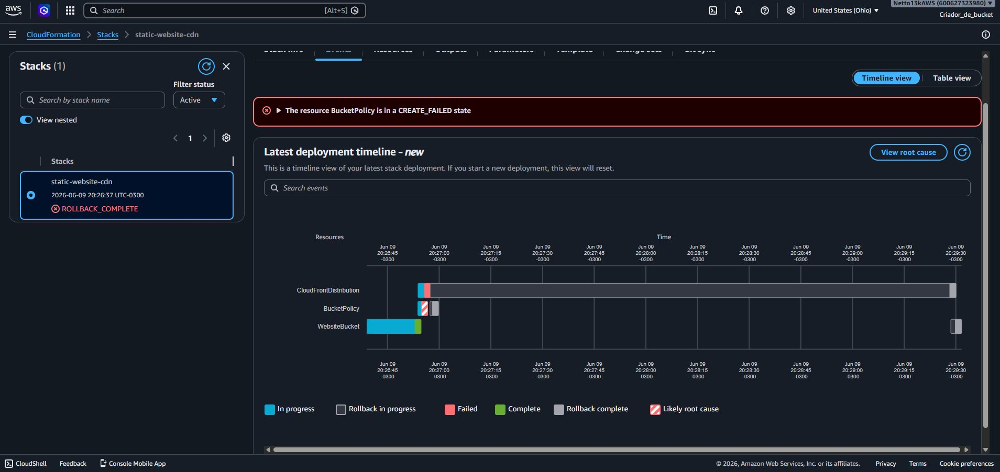

# aws-cloudformation-fundamentals

Documentação prática do laboratório de introdução ao AWS CloudFormation, realizado como parte do bootcamp na DIO. O objetivo foi entender como automatizar a criação de recursos na AWS por meio de templates.

---

## O que é AWS CloudFormation

CloudFormation é o serviço de **Infraestrutura como Código (IaC)** da AWS. Em vez de criar recursos manualmente pelo console, você descreve o que quer em um arquivo de template (YAML ou JSON) e a AWS provisiona tudo automaticamente.

**Vantagem principal:** o processo é repetível, versionável e auditável — você consegue recriar toda uma infraestrutura a partir de um arquivo.

---

## Conceitos principais

### Template

Arquivo de configuração que descreve os recursos a serem criados. Pode ser escrito em **YAML** (mais legível) ou **JSON**.

Estrutura básica de um template YAML:

```yaml
AWSTemplateFormatVersion: "2010-09-09"
Description: Minha primeira stack

Resources:
  MinhaInstancia:
    Type: AWS::EC2::Instance
    Properties:
      InstanceType: t2.micro
      ImageId: ami-xxxxxxxxxxxxxxxxx
```

### Stack

Uma stack é o conjunto de recursos criados a partir de um template. Quando você faz o deploy de um template, a AWS cria uma stack com todos os recursos definidos nele.

- Criar o template → fazer deploy → AWS cria a stack
- Deletar a stack → AWS remove todos os recursos associados automaticamente

### Stack de Firewall

No laboratório foi criada uma stack responsável por configurar múltiplas instâncias EC2 interligadas, com regras de firewall (Security Groups) aplicadas em conjunto. Isso demonstra como o CloudFormation gerencia dependências entre recursos — ele sabe a ordem certa de criação sem que você precise definir manualmente.

---

## YAML vs JSON

| | YAML | JSON |
|---|---|---|
| Legibilidade | Alta | Média |
| Suporte a comentários | Sim | Não |
| Uso mais comum | Templates CloudFormation | APIs e integrações |

Para templates CloudFormation, YAML é o formato preferido por ser mais fácil de ler e manter.

---

## Fluxo de trabalho

```
Escrever template (.yaml) → Upload no CloudFormation → Criar Stack → AWS provisiona recursos
                                                                    ↓
                                                         Monitorar eventos na aba Events
                                                                    ↓
                                                         Stack com status CREATE_COMPLETE
```

---

## Boas práticas observadas

- Sempre adicionar uma `Description` no template para documentar o propósito da stack
- Deletar stacks de teste após o uso — todos os recursos são removidos juntos, sem risco de esquecer algo rodando
- Versionar os arquivos de template no GitHub

---

## Referências

- [Documentação AWS CloudFormation](https://docs.aws.amazon.com/cloudformation/)
- [Referência de tipos de recursos](https://docs.aws.amazon.com/AWSCloudFormation/latest/UserGuide/aws-template-resource-type-ref.html)
- [Exemplos de templates](https://github.com/awslabs/aws-cloudformation-templates)

---

## Lab 2: Static Website com S3 + CloudFront via CloudFormation

### Objetivo

Provisionar uma infraestrutura de hospedagem de site estático usando AWS CloudFormation com Infrastructure Composer — interface visual para construção de templates.

### Arquitetura proposta

```
Usuário
  |
CloudFront (CDN)
  |
S3 Bucket (site estático)
```

Recursos definidos no template:

| Recurso | Tipo | Função |
|---|---|---|
| WebsiteBucket | AWS::S3::Bucket | Armazena os arquivos do site |
| BucketPolicy | AWS::S3::BucketPolicy | Permite leitura pública dos arquivos |
| CloudFrontDistribution | AWS::CloudFront::Distribution | CDN global com redirect HTTP → HTTPS |

### Infrastructure Composer

O template foi criado e validado no **AWS Infrastructure Composer** — ferramenta visual integrada ao CloudFormation que permite construir e editar templates JSON/YAML com visualização dos recursos em canvas.


*Template `static-website-cdn.json` validado no Infrastructure Composer. Status: "No template validation errors".*

### Deploy da Stack

O template foi importado diretamente do Infrastructure Composer para o CloudFormation via URL do S3.


*Template importado com sucesso via Infrastructure Composer. URL gerada automaticamente no S3.*

### Resultado: ROLLBACK_COMPLETE

A stack entrou em `ROLLBACK_COMPLETE` — criou parcialmente e reverteu tudo.



### Por que falhou

O recurso `BucketPolicy` entrou em `CREATE_FAILED`, causando o rollback de toda a stack.


*Timeline mostra: WebsiteBucket criado com sucesso (verde), BucketPolicy falhou (vermelho), CloudFrontDistribution revertida junto.*

**Causa raiz:** o template define `Principal: "*"` na política do bucket, que permite acesso público a todos os objetos. A partir de 2023, a AWS ativa o **Block Public Access** por padrão em todas as contas novas — qualquer política que tente conceder acesso público é bloqueada automaticamente, mesmo via CloudFormation.

**Como corrigir:** desativar o Block Public Access no bucket antes do deploy, ou — abordagem mais segura e atual — usar **Origin Access Control (OAC)** no CloudFront em vez de política pública. Com OAC, o bucket fica privado e só o CloudFront tem permissão para acessá-lo.

### O que o erro ensinou

- `ROLLBACK_COMPLETE` não significa que o template está errado — significa que a AWS reverteu para proteger o estado da conta
- Políticas públicas no S3 são bloqueadas por padrão em contas novas
- O CloudFormation desfaz todos os recursos criados quando qualquer etapa falha, garantindo consistência
- A aba **Events** é a primeira fonte de diagnóstico quando uma stack falha