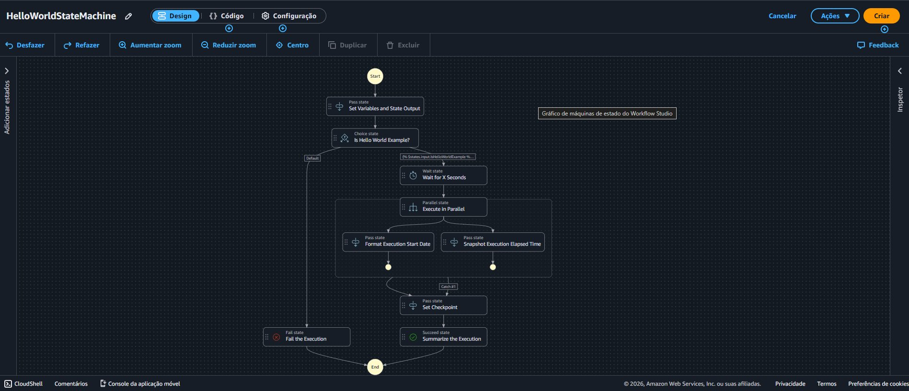

# AWS Step Functions

Anotações e prática introdutória sobre AWS Step Functions, realizadas como parte do bootcamp na DIO.

---

## O que é

AWS Step Functions é um serviço de orquestração de fluxos de trabalho serverless. Em vez de encadear serviços AWS manualmente via código, você define o fluxo em um arquivo e a AWS gerencia a execução, os erros e as transições entre etapas.

**Analogia direta:** é o maestro da orquestra — não toca nenhum instrumento, mas determina quando e como cada um entra.

---

## Conceitos básicos

**State Machine (Máquina de Estados):** o fluxo completo, definido em Amazon States Language (ASL), um formato JSON estruturado.

**Estado (State):** cada etapa do fluxo. Os principais tipos:

| Tipo | O que faz |
|---|---|
| `Pass` | Passa dados adiante sem executar nada — útil para transformações simples |
| `Choice` | Ramificação condicional (if/else) |
| `Wait` | Pausa por tempo definido |
| `Parallel` | Executa branches ao mesmo tempo e aguarda todas terminarem |
| `Task` | Executa algo — chama Lambda, API ou serviço AWS |
| `Succeed` | Encerra o fluxo com sucesso |
| `Fail` | Encerra o fluxo com falha explícita |

---

## Prática: HelloWorld State Machine

Criada via **Workflow Studio** — interface visual low-code do console AWS que permite montar o fluxo arrastando estados e gera o ASL automaticamente.


*State machine HelloWorld criada no Workflow Studio. O fluxo cobre os principais tipos de estado: `Pass`, `Choice`, `Wait`, `Parallel`, `Fail` e `Succeed`.*

### O que o fluxo faz

```
Start
  ↓
Pass — Set Variables and State Output
  ↓
Choice — Is Hello World Example?
  ├── Sim → Wait (X segundos)
  │          ↓
  │        Parallel — Execute in Parallel
  │          ├── Pass: Format Execution Start Date
  │          └── Pass: Snapshot Execution Elapsed Time
  │                    ↓
  │                  Pass — Set Checkpoint
  │                    ↓
  │                 Succeed — Summarize the Execution
  │
  └── Default → Fail — Fail the Execution
End
```

> **Por que não executei:** o Workflow Studio é gratuito para uso, mas execuções de Standard Workflows cobram por transição de estado. Para fins de estudo, criar e visualizar o fluxo já cobre o objetivo do laboratório.

---

## Exemplo mínimo de State Machine em ASL

```json
{
  "StartAt": "PrimeiraEtapa",
  "States": {
    "PrimeiraEtapa": {
      "Type": "Task",
      "Resource": "arn:aws:lambda:...:MinhaFuncao",
      "End": true
    }
  }
}
```

---

## Quando usar

- Coordenar múltiplas funções Lambda em sequência
- Processos com aprovação humana no meio do fluxo
- Pipelines de dados com etapas dependentes
- Qualquer fluxo onde o estado entre etapas precisa ser preservado

---

## Referências

- [Documentação oficial AWS Step Functions](https://docs.aws.amazon.com/step-functions/)
- [Workshop introdutório](https://catalog.workshops.aws/stepfunctions/en-US)
- [Preços do Step Functions](https://aws.amazon.com/step-functions/pricing/)